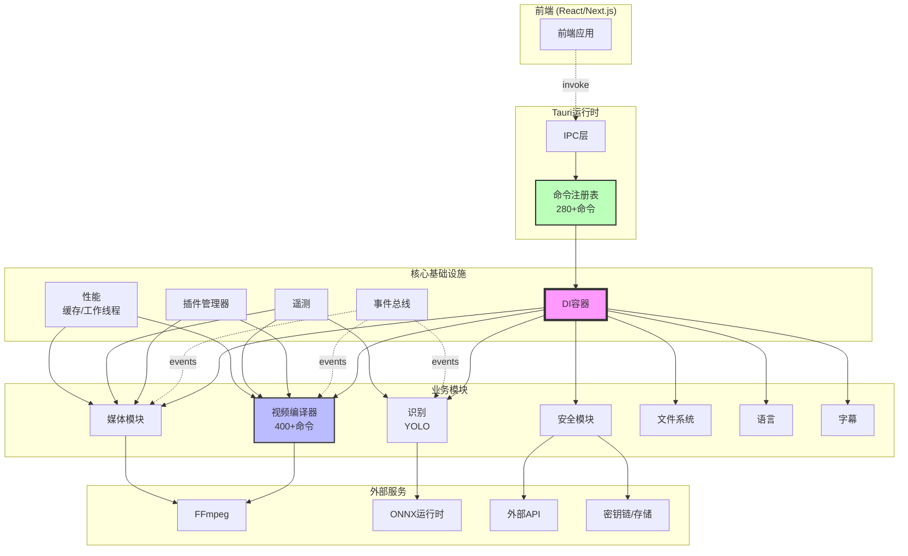

# 后端架构图

## 模块交互



## 数据流

### 1. 命令处理
```
前端 → Tauri IPC → 命令注册表 → DI容器 → 模块 → 服务
```

### 2. 事件处理
```
服务 → 事件总线 → 订阅者 → 前端 (通过Tauri事件)
```

### 3. 媒体处理
```
媒体模块 → FFmpeg → 处理 → 缓存 → 结果 → 前端
```

### 4. 视频渲染
```
视频编译器 → 管道阶段 → FFmpeg构建器 → FFmpeg执行器 → 进度事件
```

## 关键组件

### 核心基础设施
- **DI容器**: 依赖管理和服务生命周期
- **事件总线**: 组件间异步通信
- **插件管理器**: 基于WASM的插件系统，具有沙箱隔离
- **遥测**: OpenTelemetry指标、追踪和健康检查
- **性能**: 缓存(LRU/LFU/FIFO)、工作线程池、零拷贝

### 视频编译器
- **管道架构**: 逐步视频处理
- **GPU加速**: NVENC、QuickSync、VideoToolbox、AMF
- **缓存系统**: 预览和元数据的LRU缓存
- **FFmpeg集成**: 命令构建的构建器模式

### 安全模块
- **安全存储**: API密钥的AES-GCM加密
- **系统集成**: 密钥链(macOS)、凭据管理器(Windows)
- **OAuth支持**: YouTube、Instagram、TikTok
- **API验证**: OpenAI、Anthropic、Google密钥验证

### 媒体模块
- **并行处理**: 同时处理最多4个文件
- **元数据缓存**: 带TTL的缓存
- **预览生成**: 异步缩略图生成
- **格式支持**: MP4、MOV、AVI、MKV、MP3、WAV、JPG、PNG等

### 识别模块
- **YOLO集成**: 用于模型执行的ONNX运行时
- **批处理**: 批量视频处理
- **结果聚合**: 按时间和类别聚合结果

## 设计原则

1. **模块化**: 每个模块都是自包含的
2. **异步性**: 所有I/O操作都是非阻塞的
3. **安全性**: 类型安全的代码，无unsafe块
4. **性能**: 缓存、GPU加速、并行处理
5. **可观测性**: 指标、日志、追踪、健康检查

## 扩展

### 水平扩展
- 用于并行处理的工作线程池
- 通过DI的独立服务
- 事件驱动架构

### 垂直扩展
- 视频的GPU加速
- 零拷贝操作
- 频繁分配的内存池

## 扩展点

1. **新模块**: 通过DI容器注册
2. **新命令**: 添加到app_builder.rs
3. **新插件**: 通过插件管理器的WASM插件
4. **新格式**: 通过FFmpeg扩展
5. **新服务**: 通过服务容器集成